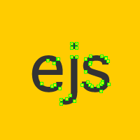
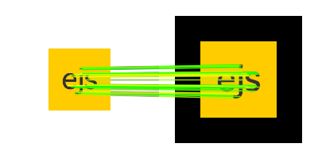
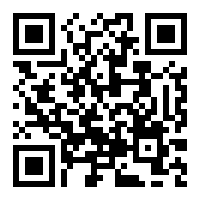

# 3D and AR on web - three.js and AR.js
For the final example, you will need a smartphone.  

## Outline:

- 3D with three.js
  - a few examples  
  - how three.js works - scene, geometry, camera, lighting  
- Augmented Reality wih AR.js 
  - location, markers, NFT
  - a few use cases
  - AR example  
  - ARStudio - make an AR example  

## Intro

Web users have increasing expectations for smooth UX, intuitive UI and attractive aesthetics.  As developers look for better ways to deliver on these expectations, 3D and augmented reality applications are becoming more common.  three.js and AR.js are two popular libraries to help with that.  

Some of the business use cases for 3D and Augmented Reality:  

    UI/UX - simply make it easier for the user to navigate the app, or understand an offering. 3D can be sublte, as it isn't the main focus.
    Novelty - surprise a user with an unexpected experience to make a site more memorable  
    Technical fit - 3D display for a 3D object  
  
WebGL is low level way to access 3D functionality on the graphics card, with these libraries on top:  
> AR.js  
>>ARToolkit.js  
>>aframe.js  
>>>three.js   
>>>>WebGL  
>>>>>OpenGL   (GLSL - GL shader language)  

## Links:  
https://threejs.org/
https://github.com/AR-js-org/AR.js  
https://stemkoski.github.io/AR.js-examples/index.html  
https://ar-js-org.github.io/studio/  
https://jeromeetienne.github.io/AR.js/three.js/examples/marker-training/examples/generator.html  
https://aframe.io/aframe-school/  
  
## Use cases gallery:   

https://showroom.littleworkshop.fr/  VR material selector  
http://www.plus360degrees.com/  see water background  
http://carvisualizer.plus360degrees.com/threejs/  
http://www.plus360degrees.com/uxcars/  car visualizer  
http://swissarmyman.com/  swiss army man  
  
## Setting up a THREE scene  
https://stemkoski.github.io/AR-Examples/keyboard-camera-move.html  
https://threejsfundamentals.org/threejs/threejs-cameras-perspective.html clipping plane, fov  
https://threejs.org/examples/?q=lights#webgl_lights_physical spot and hemisphere lights  
https://threejs.org/examples/?q=controls#misc_controls_drag  drag items  
  
### alternate renderers  
svg https://codepen.io/wandrianpenguin/pen/EKzPNM  
  
### loaders
models (GLTF, GLB, Obj, etc.)  
SVG  
json https://s3-us-west-2.amazonaws.com/s.cdpn.io/175711/horse.json   
  https://codepen.io/zadvorsky/pen/LVXeQO?editors=0010 entropony  

### conditional shading
https://codepen.io/zadvorsky/pen/MwYayb  
  
### fluid & refraction
https://codepen.io/rileah/pen/PXNZvQ water and caustics

https://codepen.io/xdesro/pen/JxOrqe  bubble with GLSL Fresnel effect   
https://s3-us-west-2.amazonaws.com/s.cdpn.io/1147877/winter-hdri_ny.png  
- slow it down - line 96   
Note triangles used to make sphere   
- adjust sphere size, mesh resolution - line 38   
As number of triangles increases, triangle artifacts are visible in a thinner layer towards the edge of the bubble (i.e., where the surface is tangent to the view)  
Note Fresnel difraction effect (chromatic abberation)     

### soft body  

https://threejs.org/examples/#webgl_animation_cloth cloth - three.js  
https://github.com/dissimulate/Tearable-Cloth/blob/master/Cloth.js  tearable cloth - not three.js  

### procedural generation
https://codepen.io/Thibka/pen/XpmbKa 3D sphere fractals  
https://codepen.io/grgrdvrt/pen/vOgyGp treee  
https://codepen.io/zadvorsky/pen/bebRPP branches and birds  
https://demos.littleworkshop.fr/infinitown  
A randomly generated city on a wrapped grid.  
https://codepen.io/shubniggurath/pen/BVKgJK?editors=1010 storm   
https://codepen.io/iondrimba/pen/MxbmGr digital raindrops  
 

## Text animation and transitions
https://codepen.io/zadvorsky/pen/GZmKYX exploding text  
https://codepen.io/zadvorsky/pen/reYxQG whirlwind  
https://codepen.io/zadvorsky/pen/KzXGXQ down the drain  
https://codepen.io/zadvorsky/pen/PNXbGo image transition  
  
## math and scientific
http://acko.net/files/mathbox2/iframe-lineup.html  
http://acko.net/files/mathbox2/iframe-labels.html  
http://bl.ocks.org/phil-pedruco/9852362  
https://www.steema.com/files/public/teechart/html5/latest/demos/canvas/webgl/threejs_example.htm  
  

https://codepen.io/frost084/pen/WgjOEE  dancing bars  
https://codepen.io/eisenh/pen/MWePmjy  voronoi  
https://codepen.io/eisenh/pen/KKMGmWd 2050  

https://codepen.io/clockmaker/pen/gpozrX many icons  
https://codepen.io/qkevinto/pen/EVGrGq three.js earth  
https://codepen.io/shubniggurath/pen/GGXKJe 500  
https://codepen.io/DollarAkshay/pen/zEpwmY three.js custom hover explode  
https://codepen.io/Flamov/details/MozgXb animated globe three.js WebGL  
https://codepen.io/mblode/pen/rfDek?editors=1010 float box with Dat.gui  
https://codepen.io/ImagineProgramming/pen/rVxWJo?editors=0010 million dots, diff w every run  

https://codepen.io/zadvorsky  
https://codepen.io/zadvorsky/pen/ZBbzBz swarm  
https://codepen.io/dissimulate/pen/KrAwx%20  
  
  
##  similar effects (not three.js)
https://codepen.io/zadvorsky/pen/OxKMbj?editors=0010 layout shift with tween.js  
https://codepen.io/dissimulate/pen/dJgMaO jelly   
https://codepen.io/dissimulate/pen/hszvg  fluid  
https://codepen.io/aecend/pen/WbONyK particle fluid  
https://codepen.io/teolitto/pen/KwOVvL?editors=1010 webGL + three  
https://codepen.io/PavelDoGreat/pen/zdWzEL?editors=1010 webgl smoke  

### videos
http://static.videogular.com/assets/videos/big_buck_bunny_720p_stereo.ogg Big Buck Bunny video for AR   
  
https://www.youtube.com/watch?v=-gZ3Kv9juYg portal video  
  
https://alteredqualia.com/xg/examples/synthetic_celebrities_evolution.html  
Just sit back and watch the steps in the deep fake face generation.  Then move your mouse to the center of the screen.  

# AR

Displaying content (3D models, images, canvas, etc.) as an overlay in the real world.  
There are 3 ways to choose where to display the content in the camera view: 
- by location (GPS), 
- by using a simplified marker with 
- recognizing a predefined set of natural features (e.g., an image) 

https://stemkoski.github.io/AR.js-examples/index.html  

marker based  
https://stemkoski.github.io/AR.js-examples/cubemap.html  
cube on Kanji marker

Example of a marker  
  
  
Features on a marker (plus the easy-to-find black border):  
  
  
Features compared with an immage:  
  
  
Go to this URL on your phone, then aim it at the ejs marker:   
  

## NFT (natural feature tracking)  
https://eisenh.github.io/ejs_3D_and_ARh0u1wg/  bbb & friend  

Make your own!  

https://ar-js-org.github.io/studio/  
